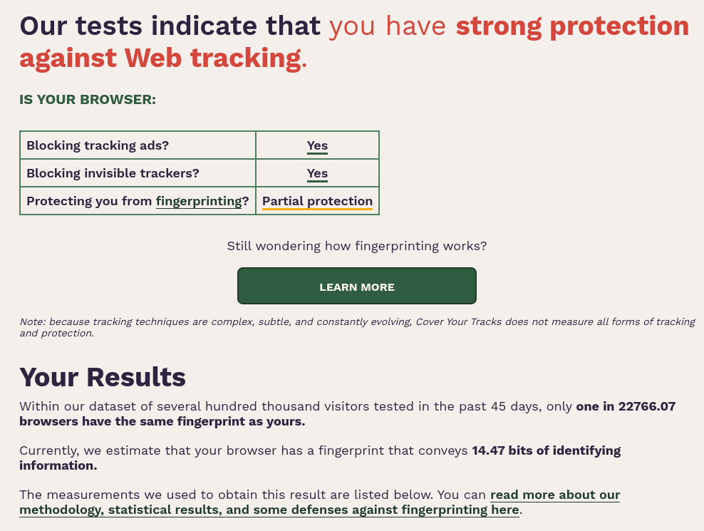

# AdvancedFox

{width=128 height=128}

## Overview
**AdvancedFox** is a project that provides some user.js files (one for privacy and another one for performance) that you can add it to Firefox.

## ✨ Features
1. Blocking ads by default.
2. Blocking trackers by default.
3. Resisting fingerprinting.
4. Linux and Windows support.
5. Free and open source project.
6. Able to choose how much privacy protection you want.
7. Better performance.
8. Able to choose how much performance level you want.
9. Setting SearXNG as the default search engine.
10. Installing uBlock Origin by default.

**After installing the policies.json and user.js files with strong level, this is the result in one of the best websites for testing fingerprinting:**

{width=988 height=745}

Note: You may not get this result, it's different between each device.

## 📥 Installation

#### user.js
1. In the [home page](https://gitlab.com/iahmed_7024-group/advancedfox), click on "[Firefox Release](https://gitlab.com/iahmed_7024-group/advancedfox/-/tree/main/Firefox%20Release)".
2. Choose "[Performance](https://gitlab.com/iahmed_7024-group/advancedfox/-/tree/main/Firefox%20Release/Performance)" if you want Firefox to be fast, or choose "[Privacy & Security](https://gitlab.com/iahmed_7024-group/advancedfox/-/tree/main/Firefox%20Release/Privacy%20&%20Security)" if you want to block ads and trackers and resist fingerprinting.
3. Choose "[user.js](https://gitlab.com/iahmed_7024-group/advancedfox/-/tree/main/Firefox%20Release/Privacy%20&%20Security/user.js)".
4. Choose your operating system.
5. Choose the privacy level that you want to use.
6. Click on the user.js file, then click on the download icon.
7. Once it's downloaded, rename it to user.js.
8. Open Firefox.
9. Type in the search bar: about:profiles.
10. Choose the profile that you want to add the user.js into it and then click on Open Directory in Root Directory section.
11. Paste the user.js.
12. Restart Firefox.

#### policies.json
1. In the [home page](https://gitlab.com/iahmed_7024-group/advancedfox), click on "[Firefox Release](https://gitlab.com/iahmed_7024-group/advancedfox/-/tree/main/Firefox%20Release)".
2. Choose [Privacy & Security](https://gitlab.com/iahmed_7024-group/advancedfox/-/tree/main/Firefox%20Release/Privacy%20&%20Security)".
3. Choose "[policies](https://gitlab.com/iahmed_7024-group/advancedfox/-/tree/main/Firefox%20Release/Privacy%20&%20Security/policies)".
4. Choose the privacy level that you want to use.
4. Click on "policies.json", then download it by clicking on the download icon.
5. Copy the file.
6. Putting the file in the right position:

###### Linux:
**Official Build**: Go to the installation directory (it may be in /opt/firefox/), then go to "distribution" folder and paste the file there.

**Package Manager**: Go to "/usr/lib/firefox/", then go to "distribution" folder and paste the file there.

**Commands** (you have to run it with privilege permissions):
1. `mkdir /opt/firefox-esr/distribution/ && mv <policies.json file location> /opt/firefox-esr/distribution/`.
2. `mkdir /usr/lib/firefox/distribution/ && mv <policies.json file location> /usr/lib/firefox/distribution/`.

###### Windows:
Go to "C:\Program Files\Mozilla Firefox\", then go to "distribution" folder and paste the file there.

## 🛑 Deletion

#### user.js
1. Open Firefox.
2. Type in the search bar: about:profiles.
3. Choose the profile that you added the user.js into it and then click on Open Directory in Root Directory section.
4. Remove the user.js.
5. Restart Firefox.

#### policies.json
###### Linux:
**Official Build**: Go to the installation directory (it may be in /opt/firefox/), then go to "distribution" folder and then remove the file.

**Package Manager**: Go to "/usr/lib/firefox/", then go to "distribution" folder and then remove the file.

**Commands** (you have to run it with privilege permissions):
1. `rm /opt/firefox-esr/distribution/policies.json `.
2. `rm /usr/lib/firefox/distribution/policies.json `.

###### Windows:
Go to "C:\Program Files\Mozilla Firefox\", then go to "distribution" folder and then remove the file.

## 🪪 License
This project is licensed under [MIT License](https://mit-license.org/).

## ©️ Credits
- A7 ([GitLab](https://gitlab.com/iAhmed_7024) - [GitHub](https://github.com/A7md70242602GH))
- SHIMORA ([GitLab](https://gitlab.com/SHIMORA_6600X) - [GitHub](https://github.com/SHIMORA-6600X))