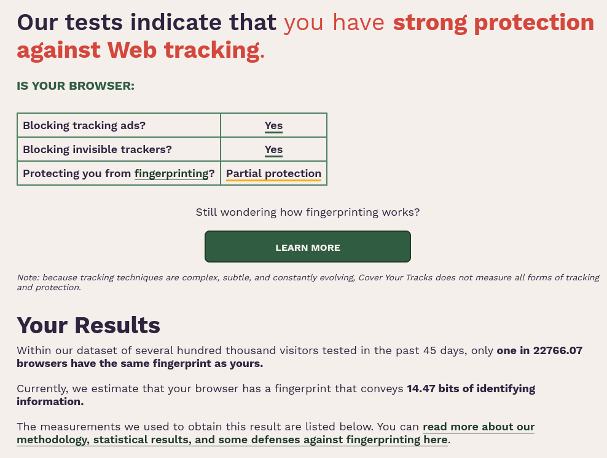

# AdvancedFox

{width=128 height=128}

## Overview
**AdvancedFox** is a project that's free and open source and it provides some policies.json and user.js files for blocking ads, trackers, resisting fingerprinting, disabling Mozilla telemetry, disabling AI features and improving the browser's performance.

## ⚔️ All policies and user.js types
Files/Levels | 📄 policies (Privacy & Security) | 📜 user.js (Privacy & Security)
-|-|-
**💪🏻 Strong** | ✅ _Sets SearXNG as the default search engine, and installs uBlock Origin and NoScript by default._ | ✅ _Blocks ads and trackers and resists fingerprinting by default._
**🛡️ Medium** | ✅ _Sets SearXNG as the default search engine, and installs uBlock Origin by default._ | ✅ _Blocks ads and trackers and resists fingerprinting by default._
**🗡️ Weak** | ✅ _Sets SearXNG as the default search engine by default._ | ✅ _Blocks ads and trackers by default._

### ⚙️ Other policies and user.js types
1. **Disable AI Features.**
2. **Disable Mozilla Telemetry.**
3. **Performance.**

## ✨ Features
- [x] **_Blocking ads by default._**
- [x] **_Blocking trackers by default._**
- [x] **_Resisting fingerprinting._**
- [x] **_Linux and Windows support._**
- [x] **_Free and open source project._**
- [x] **_Able to choose how much privacy protection you want._**
- [x] **_Better performance._**
- [ ] _Able to choose how much performance level you want._
- [x] **_Setting SearXNG as the default search engine._**
- [x] **_Installing uBlock Origin by default._**
- [x] **_Disabling Mozilla telemetry._**
- [x] **_Disabling AI Features._**

**After installing the policies.json (Privacy & Security) and user.js (Privacy & Security) files with strong level, this is the result in one of the best websites for testing web tracking:**

{width=988 height=745}

Note: You may not get this result, it's different between each device.

## 🚫 Fingerprinting Problems In Firefox ESR 140

**There are 4 things that prevent your browser fingerprint from being non-unique**:

| Objects | Reasons |
|---------|---------|
| **Cores** | _RFP sets cores count to 2 (when enabled) according to a statistic in 2017 by Mozila, but this statistic is old, and this value is nearly-unique now, the value should be 4._ |
| **Do Not Track header** | _Enhanced Tracking Protection enables "Do Not Track" sign ("Do Not Track" is a sign that send "Do Not Track" sign to any website you enter) automaticlly and can't be disabled with keeping Enhanced Tracking Protection enabled, and the problem with "Do Not Track" sign is making the browser more uniquer._ |
| **Fonts** (Linux only) | _A structural restriction in Linux support for_ `font-visibility`_._ |
| **Touch Support** (Windows only) | A bug exists in Firefox ESR 140 on Windows, but it has been fixed in Firefox ESR 153. However, this doesn't mean that ESR 153 is better; in fact, it is worse because it has fewer users than ESR 140, and the result will likely be “nearly-unique” rather than “Partial Protection”. |

**Note:** Cores, Do Not Track header and Touch Support (Windows only) issues has been fixed in Firefox ESR 153 but it's not the best because it has fewer users than Firefox ESR 140.

**These things can't be resolved by a policies.json or user.js files, the resolve key is in Mozilla's hand.**

If these issues resolved, Firefox with this user.js will show you "**Your browser has a non-unique fingerprint.**" in Cover Your Tracks test.

Here is a [discussion](https://connect.mozilla.org/t5/discussions/resistfingerprinting-inadvertently-increases-uniqueness-dnt-auto/m-p/138870#M56435) that I made and talks about 2 of the 4 problems (Cores and DNT problems).

## 📥 Installation

#### 📄 policies.json
1. Go to "[AFDC](https://gitlab.com/iahmed_7024-group/advancedfox/-/wikis/AFDC)".
2. In "Privacy & Security" section, choose the privacy level that you want to use.
3. Click on "policies.json" with the level that you chose.
4. After downloading, copy the file.
5. Putting the file in the right position:

###### Linux:
**Official Build**: Go to the installation directory (it may be in /opt/firefox/), then go to "distribution" folder (create it if not available) and paste the file there.

**Package Manager**: Go to "/usr/lib/firefox/", then go to "distribution" folder (create it if not available) and paste the file there.

**Commands** (you have to run it with privilege permissions):
1. `mkdir /opt/firefox-esr/distribution/ && mv <policies.json file location> /opt/firefox-esr/distribution/`.
2. `mkdir /usr/lib/firefox/distribution/ && mv <policies.json file location> /usr/lib/firefox/distribution/`.

###### Windows:
Go to "C:\Program Files\Mozilla Firefox\", then go to "distribution" folder (create it if not available) and paste the file there.

#### 📜 user.js
1. Go to "[AFDC](https://gitlab.com/iahmed_7024-group/advancedfox/-/wikis/AFDC)".
2. In "Privacy & Security" section, choose your operating system.
3. Choose the privacy level that you want to use.
4. Click on the user.js file with the level that you chose.
5. Once it's downloaded, rename it to user.js.
6. Open Firefox.
7. Type in the search bar: about:profiles.
8. Choose the profile that you want to add the user.js into it and then click on Open Directory in Root Directory section.
9. Backup your "prefs.js" file by copying and pasting it in the same location with "prefs.js.bkup" name.
10. Paste the user.js.

## 🛑 Deletion

#### 📄 policies.json
###### Linux:
**Official Build**: Go to the installation directory (it may be in /opt/firefox/), then go to "distribution" folder and then remove the file.

**Package Manager**: Go to "/usr/lib/firefox/", then go to "distribution" folder and then remove the file.

**Commands** (you have to run it with privilege permissions):
1. `rm /opt/firefox-esr/distribution/policies.json `.
2. `rm /usr/lib/firefox/distribution/policies.json `.

###### Windows:
Go to "C:\Program Files\Mozilla Firefox\", then go to "distribution" folder and then remove the file.

#### 📜 user.js
1. Open Firefox.
2. Type in the search bar: about:profiles.
3. Choose the profile that you added the user.js into it and then click on Open Directory in Root Directory section.
4. Remove the "user.js" and "prefs.js" files.
5. Rename the "prefs.js.bkup" to "prefs.js".

## 🪪 License
This project is licensed under [MIT License](https://mit-license.org/).

## ©️ Credits
- **A7** ([GitLab](https://gitlab.com/iAhmed_7024) - [GitHub](https://github.com/A7md70242602GH))
- **SHIMORA** ([GitLab](https://gitlab.com/SHIMORA_6600X) - [GitHub](https://github.com/SHIMORA-6600X))

## ⛔ Important Note!
This project that's available on [GitHub](https://github.com/A7md70242602GH/AdvancedFox) is for improving the visibility, the main repository for downloading and using the policies.json and user.js files are available on [GitLab](https://gitlab.com/iahmed_7024-group/advancedfox).
